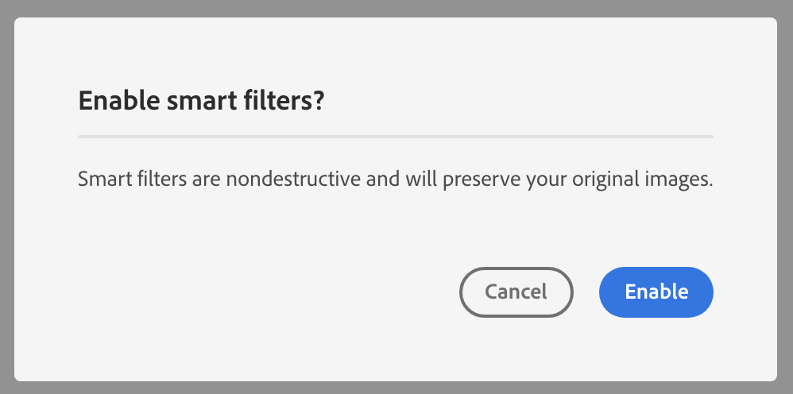

- Start Date: 2019-10-31
- RFC PR: (leave this empty, to be filled in later)
- Authors: Rob Snow

# React Spectrum v3 Semantic Elements

## Summary

Common elements should be useable everywhere and should have the right styles on them for where they are used.

## Motivation

There are many components that have headers/titles, descriptions, avatars, common types of components.
These pieces can have vastly different styles based on where they are used.

Some approaches that have been tried.

  - Specialized components for each type of container
    - Dialog with DialogHeader, DialogFooter...
    - Card with CardHeader, CardFooter...
    - becomes many variation components that do the same thing but apply different styles
  - Use CSS pattern matching
    - doesn't work well with css modules
    - if element selectors are used instead of classes, it's hard to predict usage
  - Styled components
    - doesn't work well with spectrum css

## Proposal

Create elements that represent real DOM nodes that are used in content.
Heading to represent `<h1>`..., Section for `<section>`, Avatar for a type of ``, Preview for a different type of ``.
These components all support reading from the context object where they will pick up the className they should apply.

## Design Example

Design should be able to give us two component designs that have clearly semantically similar children.
In this case both have a very clear headings, bodies, and buttons.
The headings have different font sizes, but the rest are the same.




## CSS Example

For the CSS, we might get something like this.
```css
.spectrum-Card {
  border: 1px solid lightgrey;
  border-radius: 4px;
  background: white;
}

.spectrum-Card-title {
    font-size: 14px;
}
-------------------------------------
.spectrum-Dialog {
  border: 1px solid lightgrey;
  border-radius: 4px;
  background: white;
}

.spectrum-Dialog-title {
    font-size: 18px;
}
```
There would be some limitations, we'd have to accept the general form of descendent, we might not be able to guarantee direct child or any other DOM structures.

## React Example

This might be roughly how we'd implement a Semantic Element, the idea being that they look on some context object for the appropriate className to apply.
We could have Semantic Elements clear out the context after they've consumed it, this could help prevent accidental trickle down, but wouldn't guarantee it, so it may not be a good idea.

```jsx
export const Heading = (props) => {
  let { heading } = useItemProvider();

  return (
    <h1 className={classNames(styles, heading, props.className)}>
      <ItemContext.Provider
        value={{
          avatar: null,
          heading: null,
          text: null,
          section: null,
          spacer: null,
          item: null
        }}>
        {props.children}
      </ItemContext.Provider>
    </h1>
  );
};
```

Components expecting to have Semantic Elements as children might then look something like this.
They reference their own CSS Module and supply key value pairs where the key is the name of the semantic element that the value or className should be applied to.
Not shown, they'd probably want to allow an override for this.

```jsx
export const Card = (props) => {

  return (
    <div className={classNames(styles, 'spectrum-Card')}>
      <ItemContext.Provider
        value={{
          heading: classNames(styles, 'heading'),
          description: classNames(styles, 'description')
        }}>
        {props.children}
      </ItemContext.Provider>
    </div>
  );
};
```

## End user example

A user could then concievably use the Semantic Elements as follows.
Card would provide the classes on the context and even if they are nested like this, the class will still get applied.

```jsx
<Card>
  <div>
    <Heading>Title</Heading>
    <Button>X</Button>
  </div>
  <Description>Description goes here</Description>
</Card>
```


## What will this take

 - Buy in from Spectrum CSS
 - Buy in from Design
 - 
